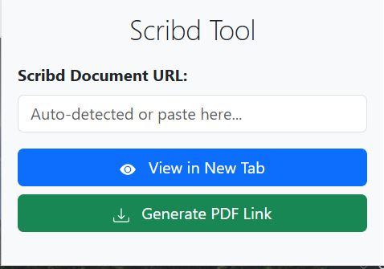

# Scribd Tool 🚀

A simple browser extension to view and generate PDF links for Scribd documents.

*(Save the image as `screenshot.png` in your project folder)*

---

## ✨ Features

*   **View Document**: Opens the full document in a new tab.
*   **Generate PDF**: Creates a direct link to download the document as a PDF.
*   **Auto-detect**: Automatically finds the Scribd URL from your current page.

---

## 🛠️ How to Install & Use

1.  **Download** this project as a ZIP and unzip it.
2.  Open your browser's extensions page (e.g., `chrome://extensions`).
3.  Enable **"Developer mode"**.
4.  Click **"Load unpacked"** and select the unzipped project folder.
5.  Go to a Scribd document page, click the extension's icon, and choose an option!
